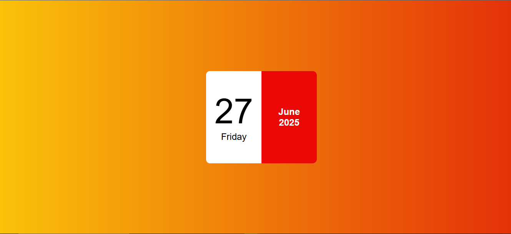

# 🗓️ Mini Calendar

This is a simple and responsive mini calendar web app built using **HTML**, **CSS**, and **JavaScript**. It displays the current date, day, month, and year dynamically and updates automatically based on the user's system time.

## 🔧 Features

* Displays current **day**, **date**, **month**, and **year**
* Built with **vanilla JavaScript** – no libraries or frameworks
* Minimal and clean **UI design**
* Fully responsive layout for all screen sizes

## 📁 Technologies Used

* **HTML5** – Structure of the calendar
* **CSS3** – Styling and layout
* **JavaScript** – Dynamic date functionality

## 📷 Preview

## 📌 Project Status

✅ Completed and working

